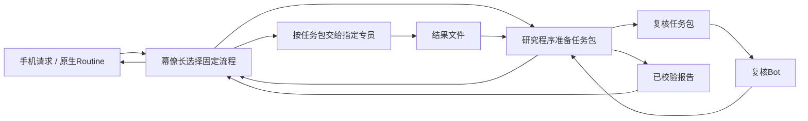

# Grok Bot 投研作业设计

版本：0.3｜2026-09-20｜设计及提示词候选，未部署、未通过 Grok 模型实测

实施取舍更新：原sec-analysis只作为部分取数实现的参考，代码复用优先级低。新系统以投研工作流、数据契约和简单可靠的执行方式为先；可新建实现，也可低成本改造原模块，不承担兼容旧接口、目录、模型或缓存结构的义务。

## 1. 本轮补齐的核心

上一版定义了职责和数据底座，但没有交付让专员真正知道如何工作的指令。本版把每个能力写成：**金融问题→输入资料→分析步骤→程序计算→结果字段→交接与异常处理**。角色名称不算能力；MCP能取到数据也不等于Bot会研究。

设计目标是让主要使用Grok 4.5/4.6的执行者完成小而清晰的判断。这里沿用用户对模型的使用反馈作为设计约束，没有对这些模型作性能排名；原生Bot实际模型由产品管理。固定工作流不要求模型设计新流程、计算收益、自由招募其他Bot或自己修改工作规则。

配套：[配置与使用](bot-kit/README.md)、[共享指令](bot-kit/prompts/common.md)、[角色指令](bot-kit/prompts/chief.md)、[任务目录](bot-kit/tasks/README.md)、[输入输出契约](bot-kit/contracts.md)、[验收案例](bot-kit/evaluation.md)。

## 2. 更完整，但保持实现小

只保留三部分：

1. **Grok Bot**：手机入口、原生Routine、读材料、有限研究、解释和复核。
2. **一个Python研究程序**：按目标工作流实现取数、快照、计算、任务状态、结果校验和报告组装。旧sec-analysis可提供供应商调用参考，是否复用按适配成本决定。一个部署单元即可，不引入新的agent框架或消息总线。
3. **SQLite + 文件/Parquet**：任务及判断记录、原始资料、数值序列。先普通检索，暂不专门建图数据库和向量记忆平台。

把原有六职责中的“数据与证据管家”主要变成程序。保留五种Bot指令：幕僚长、产业与公司研究、市场与事件、单票因子研究、复核。数量由并发需求决定，流程不要求五个同时醒着；数据采集、例行因子计算和历史收益计算不必额外养一个聊天Bot。现有Bot可以更换职责配置，无需重建账户体系。

图中程序返回待执行任务，**不假定程序可直接创建或唤醒原生Grok Bot**。原生Bot间交接由幕僚长使用产品实际具备的消息能力完成，另有固定核对Routine检查迟到任务。后续如用模型API自动调用，那是另一种执行器，不等于获得了原生Bot管理API。

## 3. System prompt不是一篇“专家人设”

每次工作只加载三层，避免把所有金融知识塞进一份巨型prompt：

| 层 | 固定内容 | 何时加载 |
|---|---|---|
| 共享常驻规则 | 事实与判断分开、使用输入时点、工具实有才调用、完成/部分/阻塞、来源可追溯、只读 | 所有Bot |
| 角色指令 | 这个岗位负责哪些问题、分析顺序、交付标准、不越权的职责边界 | 对应Bot |
| 一次任务卡 | 本次问题、证券/主题、时间、资料、程序结果、输出字段、期限与补证预算 | 每个具体任务 |

Bot不需要记住父会话。任务包必须自足：证券身份、业务目标、持有期、已知约束、上次论点、材料范围、实际工具表均随包提供。只发“帮我研究一下这家公司”不符合交接契约。

部署时：原生产品用Bot描述+明确保存的私有skill+Routine显式指定作业；如果用API执行器，才将共享与角色部分作为system/developer指令、任务包作为输入。不能把Bot名字、描述或普通聊天记忆当成已验证生效的system层。[Bot配置](https://docs.x.ai/grok-bot/bots) · [Skill/Routine](https://docs.x.ai/grok-bot/skills-routines-and-automations)

## 4. 金融场景与首版实现选择

| 场景 | 具体研究问题 | 作业/执行者 | 采用方式 |
|---|---|---|---|
| 每日持仓/自选变化 | 上次判断以来哪些事实、预期或价格条件变化？ | T01事件 + T06综合；市场、幕僚长 | 首版；程序先做增量，不每日全量重写 |
| 财报后研究 | 报表质量、指引与预期差改变了什么？ | T01的earnings模式、必要时T02 | 首版；日期/数值差由程序核对，模型解释驱动 |
| 产业链早期发现 | 新需求卡在哪，哪些公司在送样/认证/扩产？ | T03；产业Bot | 首版；改造serenity研究方法，线索与投资结论分开 |
| 公司深研 | 收入从哪来，增量增长如何变成现金流？ | T02；产业Bot | 首版；分部、单位经济、客户和竞争，不泛列优缺点 |
| 估值及理想价格 | 当前价格隐含什么？在哪些条件下有回报空间？ | T04假设→程序计算→T04解释→T06 | 首版；模型不给未经计算的目标价 |
| 单票因子实验 | 某变量能否改善一个具体交易决定？ | T05；因子Bot+研究程序 | 首版；有限假设，固定验证，不自由生成代码 |
| 因子日常更新 | 已验证信号今天是什么状态？ | 程序计算→T06引用 | 首版；不每日重新挖因子 |
| 多空反证与质量检查 | 引用支持结论吗？最有力的另一种解释是什么？ | T07；复核Bot | 首版；无多轮角色辩论 |
| 历史判断复盘 | 当时逻辑错在哪，结果受哪些因素影响？ | T08；幕僚长+程序 | 首版；只提出经验候选 |
| 财报前/催化剂日历 | 市场预期、公司指引、关键观察点是否不同？ | T01的preview模式 | 二期完善；没有历史共识时不伪造预期差 |
| 同业筛选/新主题发现 | 业务可比的候选有哪些？从何处发现新增需求？ | 程序粗筛→T02/T03 | 二期扩广度；不按低PE自动排名 |
| 宏观/行业传导 | 利率/汇率/商品/监管如何影响收入、成本和估值？ | T01的macro模式→T02 | 二期完善；指定受影响公司和传导路径 |

这里8种任务模板服务12类场景，不需要12个Bot。首版范围完整覆盖三个原始目标和复盘；分阶段增加数据深度，不无止境增加角色。

## 5. 模型与程序分别做什么

| 工作 | 程序负责 | 模型负责 |
|---|---|---|
| 取数 | 已选provider适配、授权读取、限速、重试、快照、来源时间 | 指出缺少哪项证据；有开放检索权限时做有限补证 |
| 证券识别 | 代码/交易所/币种、ticker历史映射 | 名称有歧义时指出，不猜ID |
| 文档 | 提取文本/表格、稳定页码、hash、精确重复合并 | 抽取业务关系、区分陈述/观点/传闻、识别反证 |
| 新闻与社交 | 时间过滤、原始ID/URL去重、候选事件簇 | 判断是否同一事件、叙事方向、传播与基本面是否相关 |
| 财务/估值 | 同比环比、单位换算、股本净债桥、场景计算、敏感性 | 选适用估值方法、解释业务假设和同业可比性 |
| 因子 | 公式、数据对齐、标签、验证、成本、基准、图表 | 给出经济理由、解释程序结果和失效条件 |
| 总控 | 固定依赖、就绪节点、期限、重复抑制、回执入库 | 识别用户意图、选择模板、提出下个有价值的问题 |
| 复核 | JSON/字段/ID/时间/数字/版本等机械检查 | 原文是否支持结论、业务逻辑跳跃、遗漏的替代解释 |
| 记忆 | 保存旧判断、到期收益/风险计算、版本/检索 | 回顾判断质量、提出有适用条件的经验候选 |

**程序可证明格式和计算符合规则，不能证明投资观点正确。** 模型仍对业务理解和研究意见负责；复核针对来源和推理，不把同模型的第二次回答当独立事实。

## 6. 固定工作流，不让幕僚长临时编排

只有5条流程，模板版本由工程维护：

| 流程 | 固定步骤 | 可并行 / 部分失败 |
|---|---|---|
| daily-review | 取持仓/自选增量→T01→读已有T02/T04/因子快照→T06草稿→T07→校验发布 | 不同标的事件可并行；缺社交不阻断有公告支持的判断，缺报价不能给当前价格动作 |
| company-study | 资料包→T02与T01→T04假设→程序估值→T04解释→T06→T07→发布 | T02和T01可并行；缺历史共识保留假设性比较 |
| chain-discovery | 主题资料→T03→最多3个候选的T02→重点候选T04假设/计算/解释→T07→主题报告 | 最多2个独立候选并行作为试运行起点；早期线索可独立交付，估值未就绪不抹掉线索 |
| factor-study | 数据覆盖检查→T05提出有限协议→程序锁定并执行→T05解释→T07→实验报告 | 无外层自动再提案循环；协议不适配时交工程或下一研究任务 |
| weekly-review | 提取到期判断→只释放过程包→T08-process保存→才释放结果包→T08-outcome→T07→追加复盘 | 未到期继续等待；两个独立任务/可见快照，防止先看到结果再声称盲评；不自动修改prompt |

流程任务数量上限是可修改的试运行参数，必须明示版本；不是宣称Grok固定承载多少并发。一次专员响应只做一个任务，不在子任务里再招子Bot。必须补证时最多提交2项明确请求，已有工具可在包中给定预算内完成，缺权限则返回缺口。

固定流程不代表研究问题或因子只能永远固定。新的因子假设可以给出经济机制、所需字段、滞后与窗口、预期失效状态，再交工程任务实现并登记；只有运行和验证协议保持固定。现有软件开发Bot可做这种离线开发，但不在日常投研run中临时生成并执行未经检查的代码。

### 派发与汇合的具体机制

幕僚长运行程序取得 `ready_tasks`，将每张完整任务包交给对应Bot。专员写入分配的result文件，并向幕僚长返回task_id和路径。幕僚长运行结果导入，程序决定还缺哪些节点。没有公共Bot派发API时，程序只列队列；不虚构自动唤醒。消息回执是否能稳定唤醒Chief并续跑同一run，仍是PoC假设，须首先在真实账户验证；失败时由核对Routine或人工补推，不宣称自动闭环已成立。

原生通知可能丢失：例行核对Routine读取程序的到期任务清单，已存在结果则导入，未完成则一次提醒/重派。若整个Bot平台不运行，该模式无法保证实时恢复；要求可靠漏报告警时再加独立监测。没有证据前不声称端到端无人值守SLA。

### 结果处理

- 结构缺字段：返回精确错误，同一任务最多修正1次；仍错就partial/blocked，不靠模型反复猜。
- 取数网络超时：程序按该provider规则有限重试；认证失败立即停止该源，模型不处理凭证。
- 关键研究证据冲突：保留双方及具体冲突，不“取平均”；只有受影响的结论受限。
- 审查：一次独立复核、一次针对性修订；依然有阻塞项时保留部分研究或未解决状态。
- 报告归档与手机发送分开记状态；没有发送回执记delivery_unconfirmed。若原生产品不提供可靠发送回执，不承诺恰好一次送达。

## 7. 程序接口设计（均待实现，不是现有命令）

按目标职责组织模块，允许新建工程或改造现有工程。下面是逻辑入口，不要求7个微服务，也不绑定旧Client/CLI接口：

| 入口 | 输入 | 输出 / 明确职责 |
|---|---|---|
| prepare | workflow、对象、as_of、已配置数据源 | 数据快照、任务包、ready_tasks；固定依赖和范围检查 |
| import-result | task_id、结果文件 | 校验回执/缺字段列表、下一就绪节点；幂等追加 |
| compute | T04提出且通过格式/单位校验的估值假设，或已登记的冻结实验ID | 计算结果、来源、计算版本、警告；不执行LLM生成的任意代码 |
| review-packet | run_id | 关键主张、原始出处、计算和缺口；不塞满聊天记录 |
| finalize | run_id | 基于校验/复核状态生成标准报告和手机摘要，记录版本 |
| status | 可选run_id、当前时间 | 迟到/失败/待补证/待通知；修复不改变投资判断 |
| review-due | 截止日 | 首先只给到期历史决定/过程包；process收件后才释放独立的后续结果包 |

输出根目录由部署配置指定。任务产物按run/task分目录；Bot只读资料包、写自己的结果；主库通过导入服务修改。初期可在同一云机运行，仍不是跨Bot安全隔离；备份与关键主记录要求独立保存时再迁到受控服务。

程序开发先后：定义工作流需要的数据契约→最小取数与prepare/import-result/status→daily/company闭环→估值compute→chain/factor/复盘。旧实现仅在相关模块开发时用作参考或局部复用，不作为前置兼容目标。每一步绑定spec与验收，不先建通用工作流编辑器。

T04的假设始终保留proposed标签；程序成功计算仅说明输入合法，T07负责检查方法和证据，必要时由用户决定是否采用关键假设。T06可先给标的研究意见，但当前价格条件需要合格报价/估值；账户动作和仓位需另有真实时效持仓及用户约束版本，未提供时该字段为空，不阻止其他研究。

## 8. 金融能力如何从现有资源落到本方案

现有调研继续有效，但这次按作业内容提取：

- serenity：需求—瓶颈—公司暴露—利润—价格的研究顺序，落到T03/T02/T04；不把它当数据源。
- TradingAgents：分析师输入问题和固定节点参考，落到角色职责与T07反证；不引入牛熊反复辩论或强迫买卖。
- Dexter/金融建模skills：分部研究、同业可比性、估值假设和敏感性，落到T02/T04；计算交程序。
- WorkBuddy市场新闻/妙想/同舟：事件分类、工具路由、先列表后原文、字段和覆盖界限，落到T01和取数适配；不复制宿主授权。
- 现有量化库/RD-Agent：实验登记、执行、反馈分工，落到T05；不开放无上限自动搜索。
- 论点跟踪/记忆研究：旧判断版本、反证、下一证明点，落到T06/T08；不让模型“学习”直接改规则。

新增专题记录精确prompt/文件依据与适配取舍；我们的常驻与任务文本为独立编写，研究来源不直接成为运行指令。

来源与任务映射见[Prompt源码审计](research/10-financial-prompt-source-audit.md)、[12类金融作业调研](research/11-financial-scenario-playbooks.md)、[原生Bot与程序运行边界](research/12-simple-runtime-design.md)。专题是研究输入；运行岗位数、任务字段和流程统一以本规格与bot-kit为准，不能将不同专题的示例枚举混用。

## 9. 验收：Bot是否真的知道怎么做

先用离线合成包检查所有岗位都能收到完整输入，随后必须在用户实际Grok Bot运行同一组任务，比较“旧角色说明”与“新常驻+任务卡”。至少覆盖普通可完成任务、资料缺失、来源矛盾、财务单位、早期供应链线索、因子无增量、历史复盘和迟到结果。

记录实际产品版本、可观察的模型信息、prompt/task版本、输入hash、工具调用、耗时、成本和产物。产品未暴露模型名时记录unknown，不能把结果宣称为Grok4.5或4.6基准。单独API实验须记录真实model ID，不能替代原生Bot工具/记忆/调度测试。

验收分开：机械完整性由程序检查；金融研究质量由人对照原文评分；运行可靠性用真实Routine/手机链路验证。错误单位、引用不支持、未知值补数、越权改协议属于必须解决的问题；文风不作硬门槛。新prompt是否降低失败率要看实际对照，不能只看字段齐全。

本轮交付是作业设计、指令正文、任务卡和验收包。尚未接入真实Grok运行，也未实现这些程序入口；可直接进入配置试跑与程序开发评审，不能标成系统已能常态运行。
