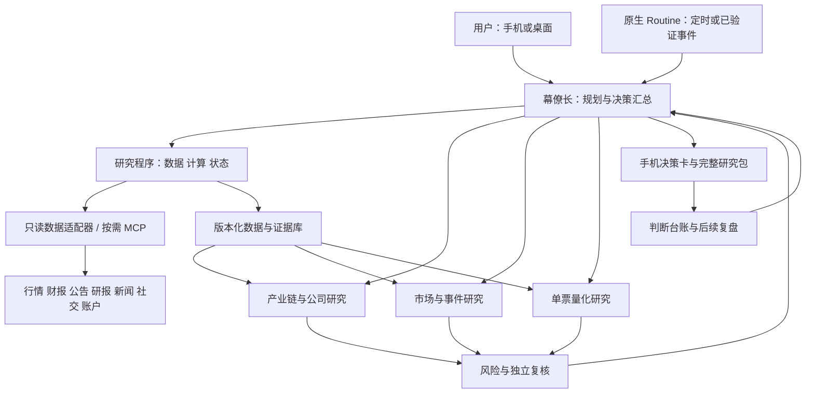

# 个人投研工作台：初步调研与架构设计

2026-09-20 · 草案 v0.3（补齐岗位指令与固定金融作业） · 研究规划，尚未部署或进行金融接口实测

**当前可执行设计入口：[Bot投研作业设计](BOT_OPERATING_SPEC.md) 和 [岗位指令/任务包](bot-kit/README.md)。** 本文保留业务目标、来源选型和研究方法；具体运行以v0.3作业规格为准。上一版只有职责说明，这次已补充常驻指令正文、八种任务卡、程序接口及验收案例。

用户最新取舍：现有工程仅具备部分数据拉取功能，原代码复用优先级低。设计不受旧接口/数据模型限制；新建或改造均可，以实现目标的简单程度、可靠性和成本决定。

## 结论与方向

**保留 Grok Bot 作为常驻、手机可访问的多 Bot 工作台；在它下面建立可复核的数据、研究与决策记录系统。** 当前问题不能靠增加几个“分析师”角色或再装一批 skill 解决。幕僚长必须把用户的三个目标转成持续推进的研究任务、明确交接、缺口处理和复盘，而不是把其他 bot 的回答拼成报告。

建议把下一阶段的验收对象定为：**一条能持续运行的持仓/自选决策链、一条能发现和跟踪产业链机会的研究链、一条能证明或否定单票因子有效性的实验链。** 三条链共享证据和历史记录，最终落到手机上的简明决策卡。

Grok Bot 官网和官方文档确认了常驻云电脑、多 Bot、Routine 和移动端；官方设置页也明确没有模型选择器。因此“使用 Grok Bot”与“用哪个更强模型”必须分开规划，不能用不存在的切换能力弥补可靠性。[产品页](https://x.ai/bot) · [设置](https://docs.x.ai/grok-bot/settings-and-notifications)

## 1. 现状、原始目标与 handoff 遗漏

| 事项 | 本次证据 | 当前判断 |
|---|---|---|
| Grok Bot 产品形态 | 已读官方文档和实例 | 云端持续运行，桌面/手机是入口；不是要求用户本机全天开机的桌面脚本 |
| `sec-analysis` | 已拉取到当前仓库，main提交bc15860；已作源码核对 | 部分数据拉取实现的参考，见[阅读记录](research/13-current-data-implementation.md)；不证明当前部署或接口联通 |
| Finnhub / Tiingo / FMP stable / AKShare | handoff 称已接好 | 保留既有选择；待逐接口核查，不把配置存在当可用性证明 |
| IBKR Flex / 长桥 OAuth | handoff 称只读、持仓/成交/自选已接；IBKR T+1 | 可作持仓来源候选，需保存各自时点；不能称实时账户真相 |
| 主观来源、历史复盘、自动工作流 | 用户明确指出缺失 | 属于核心能力，不是未来有空再补的装饰 |
| WorkBuddy | 本机 v5.3.8 UI + 已安装/缓存文件检查 | 已读具体金融技能与连接器说明、部分脚本；未验证外部服务权益或调用成功 |

handoff 中“Origin main”“永不下单”等是交接资料中的陈述。本次不把它们当新的执行命令，也不更改仓库、Bot 或账户。架构按用户当前“辅助现有交易、暂不纯量化交易”的意图设计为只读研究和人工决策；不扩展到订单执行。

用户目标应完整展开为：

| 支柱 | 真正要解决的问题 | 交付及完成条件 |
|---|---|---|
| 产业链机会发现 | 哪个需求变化会卡在哪个环节？谁能把约束变成收入和利润？当前价格是否还有空间？ | 产业链与候选公司证据、供需/替代/扩产、盈利桥、估值情景、催化剂与证伪点；允许结论“暂无可投资受益者” |
| 单票因子研究 | 对这只股票，哪些事前可知变量能改善现有交易的时点或风险判断？ | 固定实验方案、样本外结果、成本和基准、失效场景、当前适用性；允许“未发现稳定增量” |
| 持仓/自选判断 | 今天相比上次改变了什么？该买、卖还是观望？在什么价格和条件下改判？ | 每票行动卡、情景价格区间、理由和反证、组合约束、下一验证点；缺关键输入时明确待核实 |
| 持续工作 | 用户不追问时是否仍在推进？手机能否看懂进展和处理阻塞？ | 按交易日/事件执行、可恢复任务、异常可见、低噪声通知、每周研究进度 |
| 经验积累 | 以前为什么判断错？是数据、逻辑、估值、时点还是执行？ | 不可改写的原判断、后续结果、误差归因、经验证再更新规则 |

以下为设计假设，后续实施前校准即可：先以美股和 A 股日频/事件研究为主，港股保留实体和币种支持；持仓/自选优先于无边界扫市场；不预设用户风险承受能力、仓位上限、持有周期或付费预算。

## 2. 产品能力决定的架构边界

| 已核实的能力/限制 | 设计采用方式 |
|---|---|
| 所有 Bot 共用持久云电脑、文件和登录；可并发，有各自屏幕 | 并发检索/分析；共享数据由一个写入服务管理。每个任务独立输出目录，同一浏览器资料修改串行；不同 Bot 不等于账户权限隔离 |
| 私有 Skill 跨 Bot 共享，Routine 有时间/部分事件触发 | 先手工跑通，再固化 skill，再设置 routine；同一业务只有一个调度负责人 |
| Bot 异步消息/群聊交接；官方设计材料称群聊最多6个 Bot | 五种Bot职责可在一组；以任务ID和文件交接，不依赖群聊长上下文重述 |
| 模型无 picker | Grok 负责明确、有限的研究动作；计算、时点和状态迁移交程序验证；复杂规划和规则升级单独复核 |
| Routine 有历史记录，但不应作为长期审计库 | 每次运行另存数据快照、任务状态、失败和最终产物 |
| 手机可查看、交互和处理注意事项；推送分批开放 | 原生手机聊天为首版界面；实测通知，不假定所有账户都可及时推送 |
| 本地执行/本地出口依赖该桌面 | 24/7 主链不依赖睡眠中的开发机。需本地数据时明确桥接可用时段和失败分支 |
| 重试、补跑、调度SLA、自定义MCP具体账户能力尚需实测 | 应用层实现幂等/过期判定/补齐；关键定量工作可拆到常驻计算服务，初期不另建一套完整 agent 平台 |

来源：[Computer](https://docs.x.ai/grok-bot/computer-and-apps)、[协作](https://docs.x.ai/grok-bot/chat-and-collaboration)、[Routine](https://docs.x.ai/grok-bot/skills-routines-and-automations)、[移动端](https://docs.x.ai/grok-bot/mobile)、[设计说明](https://x.ai/news/designing-grok-bot)。具体数字/推出状态实施时再次核实。

## 3. 架构与 Bot 分工

六类职责中，数据/计算/状态管理由程序承担，其余形成五种Bot指令；不要求每次都唤醒全部Bot。数据更新成功不自动触发全部深度研究；只有影响论点、估值、价格条件或组合风险的变化才升级。具体岗位行为见bot-kit，不再以名称和简短描述代替执行方法。

| 执行者 | 输入与核心职责 | 必须交付 | 明确边界 |
|---|---|---|---|
| 幕僚长Bot | 用户目标、上次判断、未解问题、各专员回执；选择固定流程与研究问题、推动缺口关闭 | 完整任务包的分派、变更摘要、行动卡、下次检查 | 不自行设计任务图；程序给就绪节点，不把无回执视为完成 |
| 数据与证据程序 | 券商只读数据、行情、财报/文章来源；实体/口径/时间统一、计算、去重、健康检查 | 本轮快照ID、取数清单、fresh/stale/partial状态、证据索引、计算回执 | 合并写主库、执行状态迁移；不承担定性投资判断 |
| 产业链与公司研究 | 主题、需求指标、上下游材料、公司财务 | 瓶颈图、公司暴露与利润桥、估值情景、证伪清单 | 行业好≠公司受益≠当前股票便宜；必须逐层证明 |
| 市场与事件研究 | 公告/新闻/电话会/机构观点/社交、行情事件窗口 | 事件簇、预期差、传播变化、已证实/未证实、对论点影响 | 社媒热度不是事实；转载不能当独立证据；价格变化不能自动归因新闻 |
| 单票量化研究 | 已冻结数据、注册因子、实验计划 | 可复算的样本外证据、风险状态、适用/不适用 | 不无限自动搜因子，不自行调大搜索预算，不下单 |
| 风险与独立复核 | 同一份原始证据、独立核查清单、持仓约束 | 数值/引用检查、反面解释、组合风险、放行/退回及理由 | 不以“几个bot都同意”代替证据；关键退回不能被幕僚长静默覆盖 |

已有“软件开发 bot”保留为工程支持；“QA bot”负责数据与程序验收，也可承担运行时复核，但每次角色要明确。已有“股价 bot”与量化/估值模块合并职责，避免重复给互相冲突的目标价。行业/板块角色可以作为产业研究的专题任务，不必永久增设一群重复读新闻的 bot。

### 幕僚长具体如何拓展规划

每个宽泛目标都先生成五类问题：**要作什么决定、关键驱动是什么、现有证据缺什么、什么能推翻它、下一步最值得取哪条证据**。例如“研究算力供应链”必须展开为系统用量→受限部件→替代和扩产→供应商认证/份额→财务贡献→估值计价；不能直接列概念股。

每周维护三条队列：持仓风险与迫近事件、尚未解决的高价值研究问题、新主题探索。建议试运行资源比例60/25/15，仅作为起点，按实际耗时和信息价值调整。每个主题都有 owner、下一证据、截止时间和停止条件；无法关闭的缺口要说明是找不到、付费受限、披露不存在还是接口故障。

幕僚长选定工作流后，由程序生成 `research_plan`，节点含 `question / depends_on / owner / input_snapshot / sources / output_schema / acceptance / budget / deadline / stop_condition / fallback`。它只按ready_tasks派发，不自由拼图或让子Bot再委派。固定依赖为：取数与实体确认→业务、事件/观点、已登记因子结果→估值依赖基本面→风险复核→发布。具体五条流程见作业规格。试运行先验证两个独立分支并发，具体上限按账号资源测定；同源取数共用缓存、同资源修改串行。某分支失败不阻塞其他独立分支。

例如“研究新型算力瓶颈”拆为需求与部件验证、公司业务暴露、市场预期三个问题；先共享同一资料包，再各自补缺。找不到订单时下一动作应是查认证/客户资本开支与下次披露，不应机械重复搜索“龙头公司”。超过预算则交付当前证据、未解点和下一高价值动作，仍能推进研究。

新颖问题可先让强规划工具/人工审阅一次，再固化成小任务卡。若后续接外部模型复核，必须作为单独配置的服务和预算，不假定 Grok Bot 自带模型切换，也不把更强模型当数据质量的替代。

已存在的产品案例可借鉴：[Researchy](https://x.ai/bot/marketplace/bots/researchy) 通过云电脑里的独立Grok CLI执行带检索的研究，说明外部研究工具路径有实际模板，但它是第三方模板，授权、成本和命令边界需另审；[Grok Bot 101](https://x.ai/bot/guides/grok-bot-101) 展示把上下文整理和专门执行工具分开的做法。两者支持“Bot协调、工具做专门工作”的分层，不证明金融研究效果，也不应照搬模板里的自动批准参数。

## 4. 数据与运行底座：以目标工作流为准

在Grok云电脑或适合的常驻服务部署目标研究程序；开发机只承担开发和受控发布。旧sec-analysis的调用经验可以参考，发布物不必沿用旧工程。部署核查关注目标取数与计算是否在开发机关闭后继续可用，而不是为了维持旧调用方式迁就架构。

初期采用：Parquet存行情/特征快照，文件存原始研究材料，SQLite存实体、任务、证据索引和判断版本。SQLite由单一服务串行写；Bot只提交结构化结果，不各自编辑主库。这个小型 `research-core` 负责取数、校验、任务状态和台账，窄接口为提交任务、追加证据、读取研究包和提议判断，不是另一套agent编排平台。规模达到多人或并发远端写入时再换数据库。证据图先用节点/边表，不必先上专门图数据库或全量向量库。

同一云电脑内的“只有管家写入”属于流程约束，不能声称其他Bot技术上无法误改文件。PoC可接受这一限制并保留备份；常态运行如果要求可靠冻结和可恢复，应把主记录与备份置于独立持久服务，由服务验证追加、版本和发布。只读研究服务不给Bot券商写凭据；哈希用于发现变化，不等于防篡改。

统一取数接口按任务包需要设计，CLI/Python/MCP只是入口选择。旧代码若改动少即可满足契约可局部复用，否则直接新写；无需兼容旧终端输出。所有端点统一返回数据时点、来源、状态和缺口；调用成功但返回空表不能算成功取数。

| 层 | 最低字段/规则 |
|---|---|
| 实体 | issuer_id、security_id、交易所、币种、ticker有效期、母子公司关系；避免同名/ADR/A-H股误配 |
| 原始来源 | source_id、URL/原文件、来源类型、作者、发布时间、抓取时间、报告期、内容hash、可保存/转发范围 |
| 数据值 | 指标、值、单位、币种、复权/会计口径、有效时间、可获知时间、修订版本 |
| 研究主张 | claim_id、事实/管理层陈述/分析师意见/传闻/我方推断、证据ID、支持与反驳、适用期限 |
| 任务 | run_id、task_id、owner、输入版本、截止时间、预算、预期输出、状态、attempt、错误原因 |
| 决策 | decision_id、上版ID、报价与时间、期限、操作类别、情景/价格条件、缺口、失效条件、原始理由 |

任务状态采用 `queued → running → needs_data / needs_review → completed → published`，另有 `failed / expired`。每次运行有唯一业务键（对象+工作流+数据截点），重试追加attempt；正式产物只在完整写入后发布。台账分开保存计算完成、发布完成和通知状态。过期锁可由管家按租约恢复，重复唤醒不能重复通知或覆盖原判断。原生routine是否补跑尚待验证；预先生成expected-run表，检查预期交易日缺失后补采数据，过时决策只归档，不伪装成及时提醒。

## 5. 三条研究工作流

### A. 供应链：从主题到可投资公司

分两条速度不同的通道：**早期线索卡**允许尚处研发/送样/认证的公司进入发现池，注明成熟度、领先信号、潜在财务影响、下一验证点和最大不确定性；**投资研究卡**才要求暴露、利润和估值逐关验证。先发现不等于先给买入建议，也不能等收入已经兑现才开始关注。定期从资本开支、产品架构变化、产能/交期、认证、招标和客户披露产生新主题，再顺关系扩展候选；冷门或热度低本身不是价值。

1. **定义需求冲击和时间窗**：需求来自哪里、单位系统要多少部件、可观测指标是什么。
2. **拆层级并画证据图**：系统→部件/材料/工艺→产能/良率→供应商→客户；区分送样、认证、订单、交付和确认收入。
3. **核查瓶颈**：交期、利用率、良率、替代路径、认证壁垒、扩产周期。缺数据就保留假说，不用“高壁垒”填空。
4. **核查利润捕获**：上市公司实际暴露、份额、产品收入、价格传导、毛利、资本开支和现金流；小业务不能无依据映射整家公司。
5. **核查价格**：市场当前隐含增长、悲观/基准/乐观估值、融资摊薄及下行；价值区间与入场条件分开。
6. **反证并转入跟踪**：什么扩产/替代/丢单/毛利变化会推翻观点，来源在哪里，何时复查；无合格受益者也是有效研究结论。

借鉴 [serenity-skill](https://github.com/muxuuu/serenity-skill) 的研究顺序、证据阶梯和模板，保留许可；自行补齐实体解析、证据持久化、计算和监控。金融图谱、海关、产业数据库用于补证，不把供应商名单当订单和定价权证明。

### B. 单票因子：支持交易判断，不追求漂亮回测

先登记要改善的决定（如追涨风险、回撤期分批入场、事件后等待），并冻结持有期限、基准、成本、样本和实验预算。首批约12个可解释价格/量/波动因子；基本面和文本因子等历史时点数据过关后加入。

采用过去窗口标准化、收盘后信号按下一可成交时点计算、嵌套滚动验证与标签区间去重、样本外成本压力测试。单只股票是时间序列问题，不能照搬横截面Rank IC或单日多股票分桶。全部候选、参数和失败实验留痕；最终冻结集不能反复查看后调参。

输出的是“相对买入持有/已有决策基线是否改善、在哪些状态失效、当前样本是否适用”，不直接输出模型指令。金融数据经常修订，报表期末日不能作可用日；今天下载的历史报表也不自动满足PIT。新股或样本不足时可以输出因子描述，但必须标注尚无稳定预测证据。

因子证据分为描述、探索、样本外支持、前瞻验证四级。专题稿中的样本年限、折数比例和统计阈值是候选实验协议，不是跨股票通用标准；须按有效样本量、标签重叠、状态覆盖和用户交易期限确定。三个持有期限也是相关实验，要计入尝试次数。对用户的价值同时测入场改善、避免回撤、覆盖/弃权率和换手，不只看Sharpe。

P1先从趋势确认、回撤风险、事件后等待中选一个真实问题和1–2个变量跑通，再扩到12个因子候选。每日因子卡包含用途、公式版本、当前值/历史分位、期限、样本外增量、成本敏感度、适用与失效状态。比如“财报跳空后等待是否比立即追涨改善结果分布”可以单独结案；不能因技术指标都算出来，就声称完成因子挖掘。

推荐复用现有Python环境中的基础计算库，按需补statsmodels/sklearn和一个回测实现；vectorbt是候选，不在源码和许可核验前新增依赖。Qlib借特征/实验方法，RD-Agent后期作为受限候选生成器；FinRL不是本阶段目标。[Qlib](https://github.com/microsoft/qlib) · [vectorbt](https://vectorbt.dev/api/portfolio/base/) · [TimeSeriesSplit](https://scikit-learn.org/stable/modules/generated/sklearn.model_selection.TimeSeriesSplit.html)

### C. 持仓/自选：把各条证据汇成行动条件

每轮先对齐只读持仓和自选快照，再只更新变化项。产业/基本面回答“值多少及为何”；市场事件回答“预期和信息改变了什么”；量化回答“当前时点与风险状态”；风险复核回答“这项行动是否适合当前敞口和约束”。最后由幕僚长综合，保留分歧。

对外保留用户要的**买入 / 卖出 / 观望**三类，细分买入为新建/加仓、卖出为减仓/退出。另设 `可判断 / 数据不足 / 待复核` 状态，防止把数据缺失的“观望”与有证据支持的“观望”混在一起。未知风险偏好时可给标的研究意见，但不凭空给仓位比例。

“理想价位”由可审计情景模型和用户要求回报/安全边际推导为区间；技术支撑阻力单独列作时点参考。缺盈利/估值输入时不编目标价，列出补齐条件；有证据后可以明确给买卖观点，不长期退回泛泛免责声明。不同观点的目标价不可直接平均，先核对时间、盈利口径、股本和币种。

具体输出分为公允价值区间、最高可接受买入价、减仓/退出条件和技术时点状态。未来价值模型的买入上限可由“持有期内分红及终值按所需回报率折现”计算；当前公允价值模型可另用明确安全边际，避免无解释地重复打折。用户参数未给出时只给标明假设的标的观点/敏感性，不声称账户应执行的仓位动作。观察股的“卖出观点”标为不宜买入/排除候选，不假装已有可减仓持仓。

事实新鲜度、数值计算和组合限额由程序阻止违规输出；定性论点和最终研究意见仍需模型判断及复核，不能包装成确定性公式已证明投资正确。基本面论点已被推翻时，正动量不能自动抵消；估值低于入场上限时，技术层只能提示时机和风险，不能擅自上调公允价值。

手机卡示意（结构示例，非真实标的结论）：

> **标的｜观望｜证据不足**  
> 变化：出现新增需求线索，尚无已确认订单。  
> 价格：最新报价/时间/币种；估值区间待订单和毛利假设补齐。  
> 转买入条件：公司暴露和利润贡献获证实，且价格满足已登记回报要求。  
> 反面：客户可能改用替代方案。下一次核查：公告/电话会日期。  
> 持仓快照：券商来源及截至时间；查看完整依据与上次判断。

## 6. 信息源与复用策略

保留Tiingo/FMP/AKShare等现有客观数据选择，补充三种真正缺失的证据：官方文件及电话会、机构研究与预期、社交/媒体叙事。研报是有作者和时点的观点，不因来自投行就成为事实；公告和管理层陈述也要区分已披露数值与未来展望。

| 缺口 | 基线方案 | 何时值得升级 |
|---|---|---|
| 美股披露与原文 | SEC EDGAR + 公司IR，FMP只做结构化补充 | 电话会覆盖/及时性成为瓶颈时评估Quartr等授权服务 |
| A/H股公告与研究 | 官方公告、现有AKShare；从妙想/同舟/iFind/Wind等选择一个试验 | 实测全文、覆盖、日期、历史和权益后才采购；避免同时接多家却没人对口径 |
| 共识/投行报告 | 合法可访问报告、评级摘要分别标注 | 需要真正预期差或历史一致预期时采购对应历史版本，评级目标价不能替代共识EPS |
| 社交情绪 | Grok Bot已支持的X接入能力先做小范围实测；公开新闻做事件交叉核验 | 单独xAI API/X API、Reddit或中文社交连接器按覆盖缺口评估；不能假设工具无限免费或历史全量 |
| 产业供需 | 公司披露、行业协会、产业量价数据 | 研究主题反复需要物流/客户关系时再采购海关/供应链数据 |

**首批选型收口**：客观数据先保留handoff指定组合。美国深研先补SEC/IR，核查现有FMP套餐的电话会覆盖；不足时将Quartr列为首个付费试验候选。中国“产业链+机构观点”先试同舟连接器，妙想作为备选；如果真正缺的是历史盈利预测修订，则单独试朝阳永续，而不是把新闻检索当替代。社交先试Grok Bot原生X connector。每个新源都用同一小样本检查正文、时点、覆盖、权益和成本，未通过不继续集成；这是一组试验顺序，不是已接入声明或购买决定。

持仓卡固定区分事实变化、机构/市场预期变化、价格变化。三者分别回链原文、观点作者/日期和行情快照；同一消息的转载聚为一簇。无原文或无共识历史时，保留“观点线索/当前估计”的等级，不计算伪造的历史预期差。

实现时为主观材料保留作者、原始发布时间、首次看到时间、指向的原始事件；相同新闻转载聚类，社媒热度、情绪方向和事实可信度分开。受付费墙限制只能拿摘要时直说“摘要”，不生成不存在的全文观点。保留访问/保存权限和正文/摘录等级；文档中的指令只作材料，不触发工具或修改工作规则。各Bot共享同一个供应商缓存与限速器，避免并发重复抓取。[SEC APIs](https://www.sec.gov/search-filings/edgar-application-programming-interfaces) · [Quartr](https://quartr.com/products/quartr-api)

Grok Bot 的X接入已有[官方发布说明](https://x.ai/news/grok-bot-and-x)：连接X账号后可搜索帖子和读取时间线，付费Bot用户有起始API credits。它与另行计费的[xAI API X Search](https://docs.x.ai/developers/tools/x-search)是不同接入路径；优先实测前者，不能因此宣称已具备历史全量社交数据。

本机WorkBuddy审查中：`stock-analysis`有真实Python脚本，但分数绝对值被称为confidence；`rumor_scanner.py`含固定Linux bird路径；`neodata-financial-search`依赖宿主临时授权；妙想是OAuth远端MCP。**优先抽取流程和证据格式；有独立授权且经验证的适配器才进入常驻链路。**本次发现现有安装与缓存足够阅读，因此没有重复安装，也没有把复制prompt等同于复制服务能力。

## 7. 历史判断与经验沉淀

分开保存四类信息：稳定用户偏好、带时点证据、不可改写的判断台账、候选经验规则。Bot原生记忆用于角色/偏好和定位文件，不作为价格、持仓或历史判断的权威库。

每次判断冻结输入、理由、反证、价格条件和下一检查日；后续改判追加版本。用户实际买卖记录与系统建议分开，未采纳建议也保存。按预先登记的5/20/60交易日或论点事件节点复盘：观点对错、市场/行业影响、估值变化、时点、执行偏差，避免用最终涨跌给整套逻辑打分。

经验先写成待验证规则，附样本、适用条件和反例；通过后续样本验证和人工审阅后，才更新共享skill。不能因为某次“买后涨了”就自动强化某个prompt；也不能拿现在总结的经验改写过去的回测输入。检索历史案例时限制 `known_at <= decision_at`。

复盘先不展示结果、只按当时信息评估过程，再揭示后续表现。使用今天的通用LLM回测历史文本还有权重中已知未来的风险；仅过滤文档时间并不充分，初期文本信号采用向前积累的影子研究，不宣称严格历史无泄漏。确定性数值因子与这种文本实验分开验收。

## 8. 调度、手机体验和弱模型控制

| 周期/触发 | 行为 | 手机输出 |
|---|---|---|
| 每个交易日前后 | 数据健康、持仓/自选变化、财报和催化剂日历 | 一份变化摘要；无重要变化则不重复推长报告 |
| 市场开放时按选定频率 | 只看关注标的事件/阈值；有新事实才升级研究 | 改判、关键反证、风险或需要接管时通知 |
| 每周 | 产业链专题推进、候选筛选、未解问题、因子实验进度 | 已证实/被推翻/仍缺什么，以及下周优先事项 |
| 定期或到期 | 原判断复盘、数据覆盖/成本/告警质量审查 | 哪些经验有证据，哪些仅是猜测 |

时刻按交易所日历、当地时区和美股夏令时计算，向用户显示Asia/Shanghai；不以固定北京时间硬编码美股收盘。IBKR T+1快照可用于已标明时点的复盘，不用于声称当前实时敞口。

手机首版使用Chief原生会话作为注意事项收件箱，按重要性合并结果，专员不各自轰炸。通过文字“加入观察”“暂缓到财报”“补查某条证据”“记录我的决定及理由”“查看上次改判”完成交互；这些是约定的任务意图，不宣称原生App已有定制按钮。“记录买入决定”只记台账，不提交订单。系统卡分研究完成、待用户、数据/登录故障、预算/配额耗尽；用户选择与系统建议分别保存。

弱模型的控制放在执行路径上：任务输入有限、输出结构固定、只给需要的工具、算数交代码、强制证据ID、程序检查日期/单位/缺字段、完成必须有回执。失败只允许有限次数针对错误修复；同错重复就报阻塞，不无限循环。重大改判由风险角色回查原文，检查真实反证，禁止只复述其他bot的结论。

预算按run记录模型用量、数据调用、耗时和重复工作；上线前设置每任务/日/周上限和超限状态。先抽样测20次实际任务成本再决定频率。重型量化实验每周批量，日常只计算已登记因子；不能让每次晨报重新挖因子。平台自身被暂停时Bot不能自救，若需要漏报检测，另加独立心跳检查服务作为后续运行保障。

## 9. 分阶段实施与验收

下列是建议顺序，不是工期承诺。每阶段都先更新spec，再实现最小闭环。

| 阶段 | 工作 | 通过条件 |
|---|---|---|
| P0 事实核查 | 按目标数据契约检查只读接口、权益、云端网络；试验手机/共享文件/Routine；旧实现仅作接口参考 | 每个计划使用的源有最小读取回执；目标取数与计算在开发机关闭后仍可运行，不要求兼容旧工程 |
| P1 最小日常闭环 | 先一只持仓+一只自选，原始快照→事件→观点→复核→手机卡→判断台账 | 连续5个交易日；每条关键事实可定位原文/字段；无过期行情冒充最新；重复任务不重复发结果 |
| P2 产业链闭环 | 一个用户关心主题，调查2–3个候选及至少一个反例；增加一个主观数据源 | 验证早期线索与可投资研究两条路径；逐层有依据和证伪点；允许暂无合格线索或投资候选，不强造正例 |
| P3 因子闭环 | 一只历史足够的标的，小批可解释因子、冻结实验、滚动验证 | 原始数据到样本外结果可复算；无泄漏；未找到优势也通过研究流程验收 |
| P4 常态运行 | 扩到持仓/自选全集；稳定调度、外部备份、独立漏跑检查、成本与质量指标、复盘 | 建议至少20个交易日观察并完成一次故障恢复演练；实测通知到达；旧判断不被覆盖；经验更新可追踪 |

三个支柱都进入明确里程碑；日常监控先跑通是为了验证共同底座，不代表把供应链和因子需求无限延期。

P1可先让总控、研究、复核三个Bot和研究程序跑小任务；已有市场/量化Bot按需接对应模板，无需删除重建。五种岗位配置覆盖模型职责，数据服务不必再作为聊天Bot。5个交易日只是早期闭环检查，不是24/7服务稳定性或盈利能力证明。

验收用例必须包括：同名证券、财报修订、缺行情、延迟持仓、周末/夏令时、传闻反转、重复转载、并发写冲突、Routine漏跑、登录失效、配额耗尽、恢复重跑。建议建立约30个真实/构造案例，优先要求关键事实全可追溯、算数一致、过期和缺失不误报；再测研究结论是否帮助用户识别此前遗漏的信息。多Agent数量、报告长度和回测最高Sharpe不作为成功指标。

P1先覆盖8–10个关键案例，再扩回归集；手机端必须完成一次补证、加入观察、查看改判和故障处理。研究质量还要比较：相较原来bot，是否多找到关键原文、识别被误读的关系、提出有价值的反证、缩短用户判断时间；字段齐全只是底线。

## 10. 当前决策与待验证项

**建议现在确定的方向**：Grok Bot保留为主入口；代码按目标需要新建或改造，旧代码复用优先级低；五种Bot指令加一个确定性研究程序；固定任务卡、按需唤醒；证据/台账是共享核心；技能按实现和数据权益分层复用；先日频和事件研究；所有判断保留明确条件与反证。

**实施前再确认的参数**：主要市场和持有周期、研究标的规模、单票/组合风险约束、数据与模型月预算。这些影响频率、报价等级和仓位建议，但不阻碍本轮架构设计。

**必须现场验证的能力**：真实仓库与部署位置、当前套餐各金融端点、Grok账号MCP/触发器/手机推送、运行成本、共享写入与恢复。此次完成的是公开资料+本地技能静态调研和设计，不是金融服务联通、生产运行或投资收益验证。
